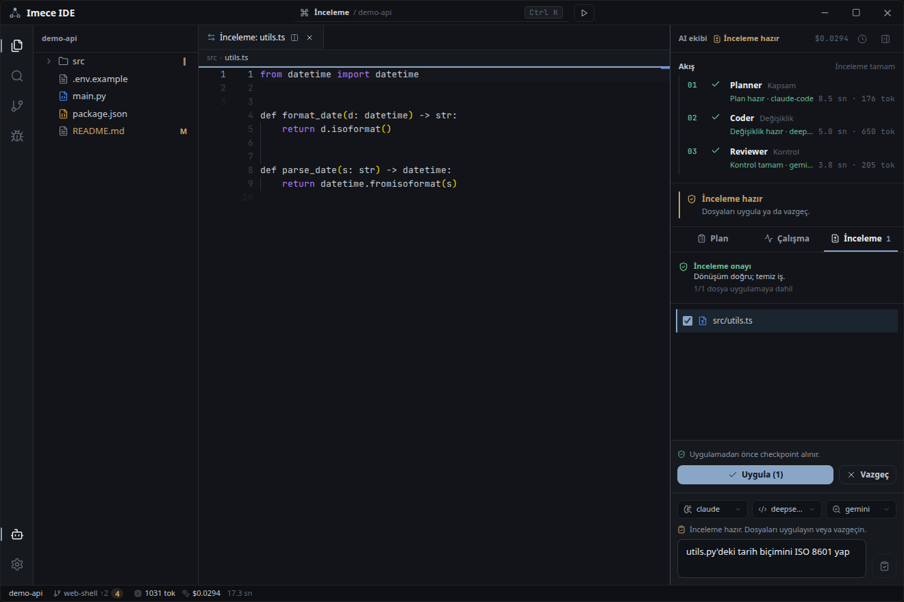

# Imece

> Public beta · `v0.4.0-beta.1` · source release, Windows-first, Linux also supported from source · [Türkçe](README.tr.md)

**Imece** is a local-first desktop coding workspace. You describe a **task**,
pick **one** provider, and a single independent coding agent works on it end to
end — in its own disposable copy of your project, with deterministic
verification behind the result. You inspect the diff and **apply** or **reject**
it yourself. Nothing touches your files until you say so, and applying takes a
checkpoint first, so one click undoes it.

This is the **actual default today**, not a roadmap item. There is no planner
step, no reviewer step and no role chain in the default flow: a task goes in,
one agent runs it, evidence comes out, you decide. The older Planner/Coder/
Reviewer trio still exists as a **compatibility backend and historical
record** — it is not the default and is not the planned product.

Around that loop, Imece still has a familiar shell: project explorer, Monaco
editor, integrated terminal, Git surface, Python language intelligence and
debugging. Those are **secondary tools**, kept and not removed — reshaping the
app around a task list (instead of the IDE layout) is the milestone now being
started and is **not done yet**.

There is also an **experimental collaboration foundation**: an explicit,
offline, metadata-first session per repository, private proposals for the paths
you name, a combined candidate built outside your checkout, and an opt-in
loopback control channel on `127.0.0.1`. It is **not connected to the default
flow**, has **no LAN pairing or TLS**, and is **not a team product** — see
[Collaboration](docs/COLLABORATION.md).



> **Screenshot: the older UI.** This capture predates the single-task default
> flow and shows the previous three-role layout.

> **Status, stated plainly.** The role-free vertical — task → single agent →
> verification evidence → continue or explicit apply — is **implemented and
> verified by local fixture end-to-end runs**. It is **not** finished: real
> provider and supported-platform acceptance is an **open gate**, deferred
> because those environments were unavailable and carried as tracked validation
> debt, so no live-quality guarantee is claimed. Milestone 2 (task-first shell
> and real concurrency) is **authorized and starting, not implemented**;
> milestones 3–5 (restart durability, two-machine pairing, packaged release)
> are **not started**. Milestone 1's deferred gate remains a release gate
> before milestone 5 and does **not** block milestone 2. See the tracked
> [product plan](docs/PRODUCT-PLAN.md).

## How it works

1. Open a local project folder and describe a task.
2. Pick **one** provider from the built-in catalog (DeepSeek, Gemini, OpenAI,
   Mistral, Groq, xAI, Qwen, Moonshot, OpenRouter, Ollama, any custom
   OpenAI-compatible endpoint, or an agent CLI such as Claude Code) and press
   **▶**. The agent works in an isolated Git worktree — never in your real
   files — with per-run latency, token and cost metrics where the provider
   reports them.
3. Verification runs deterministically inside that same isolated copy, and you
   see the evidence: what was checked, what passed, what failed or did not run.
4. Not happy? Send a **follow-up** — the same run continues from the same
   worktree and the same original task.
5. Happy? Inspect the diff file by file, then **Apply** or **Reject**. Apply
   takes a checkpoint first. **Reject** writes nothing.
6. Every run leaves a change receipt: task, scope, diff, verification status,
   cost, and apply/checkpoint state.

## Get started

Imece IDE is currently distributed as **source only** — no prebuilt binaries
yet. The desktop shell targets **Windows 10/11** first and is also usable
from source on **Linux**; you need Python 3.14 and Node ≥ 20 (details,
including Linux-specific notes, in [SETUP.md](docs/SETUP.md)).

```bash
python -m venv .venv
.venv\Scripts\python -m pip install -r requirements.txt
cd web/ui && npm ci && npm run build && cd ../..
python shell.py
```

Pick a provider in Settings → Model providers and paste its API key (the
catalog covers DeepSeek, Gemini, OpenAI, Mistral, Groq, xAI, Qwen, Moonshot,
OpenRouter, Ollama and custom OpenAI-compatible endpoints; see
[SETUP.md](docs/SETUP.md)). Agent CLIs such as
[Claude Code](https://claude.com/claude-code) need no key — install them and
they are detected automatically. Then open a project folder, describe a task,
choose one provider in the composer, inspect the suggested diff, and choose
Apply or Reject.

> Not every catalog entry can drive the single-agent flow. If a provider isn't
> supported for it, the UI says so and refuses the run rather than quietly
> substituting something else. Agent-CLI (ACP) providers do not always report
> usage, so their cost and token counters can show `—`; that means "not
> reported", not "zero".

> **Language note:** the application UI is currently Turkish. An English UI is
> planned; all documentation is in English.

## Trust and privacy

- No telemetry, analytics or automatic error reporting, and no hosted Imece
  service of any kind.
- Model calls happen only when you start an AI run; the selected context goes
  to the provider you chose for that run and nowhere else.
- API keys are stored locally — a git-ignored `.env` when running from source,
  Windows DPAPI encryption in packaged builds — and are never returned to the
  UI, put in a prompt, or written into error text. They **are** transmitted to
  the provider you selected, as that provider's auth protocol requires.
- Sharing a collaboration credential is a one-shot action that uses memory and
  the system clipboard, and explicitly selected proposal code is shared
  **verbatim with no automatic redaction**. Both are deliberate; review before
  you share.
- A project-provided run command (F5) is shown for approval before its first
  run, and re-approved whenever it changes. Verification runs your project's own
  code — it is **not** a security sandbox.
- Agents cannot write outside the project folder you opened.

Read the full [privacy statement](PRIVACY.md) and
[security policy](SECURITY.md).

## Packaging

A Windows `onedir` package can be built with PyInstaller and is verified in
CI, but official binary releases are postponed until the beta stabilizes —
unsigned executables are also prone to antivirus false positives. To build
one yourself, use Windows PowerShell:

```powershell
packaging/build.ps1
node packaging/smoke.mjs
```

## Documentation

- [Product plan](docs/PRODUCT-PLAN.md) — the tracked, authoritative plan of
  record, including what is implemented, what is deferred validation debt and
  what is not
- [Setup](docs/SETUP.md) · [Usage](docs/USAGE.md) ·
  [Architecture](docs/ARCHITECTURE.md)
- [Collaboration (experimental, loopback only)](docs/COLLABORATION.md) ·
  [Decision layer (experimental, optional)](docs/DECISION-LAYER.md)
- [Release guide](docs/RELEASE.md) · [Changelog](docs/CHANGELOG.md)
- [Contributing](docs/CONTRIBUTING.md) · [Support](SUPPORT.md) ·
  [Code of Conduct](CODE_OF_CONDUCT.md)
- [Third-party notices](THIRD-PARTY-NOTICES.md)

Licensed under [Apache-2.0](LICENSE).
