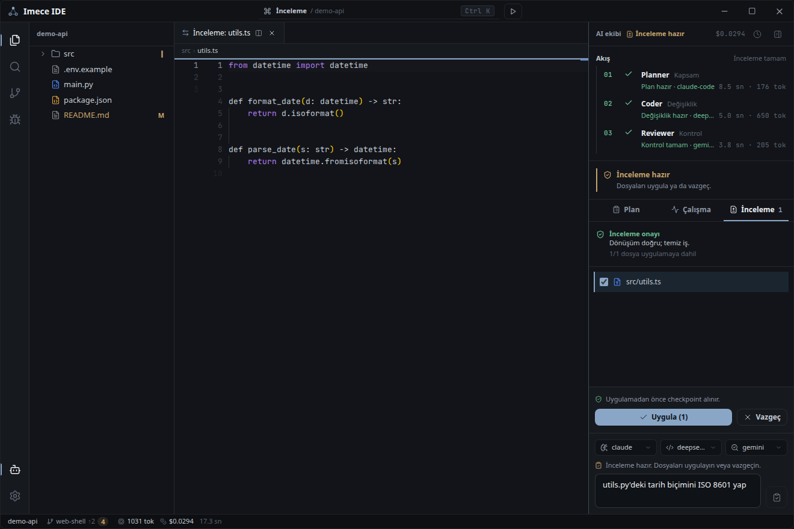

# Imece IDE

> Açık beta · `v0.3.0-beta.1` · kaynak sürüm, Windows öncelikli · [English](README.md)

**Imece**, seçtiğin modellerle çalışan bir AI ekibinin — Planner, Coder ve
Reviewer — bir değişiklik üzerinde birlikte çalıştığı ve sonucu tek bir dosyaya
dokunmadan önce incelenebilir bir diff olarak sana sunduğu, yerel-önce bir
masaüstü kodlama ortamıdır. Adını, bir topluluğun ortak bir iş için emeğini
birleştirdiği imece geleneğinden alır.

Bu akışın etrafında Imece gerçek bir IDE'dir: dosya gezgini, Monaco editör,
entegre terminal, Git görünümü, Python dil zekâsı ve debug, geri alınabilir
checkpoint'ler ve her AI koşusu için kalıcı değişiklik makbuzu.



## Hızlı başlangıç

Imece IDE şimdilik yalnız **kaynak kod** olarak dağıtılıyor; hazır bir
`.exe` paketi henüz yayınlanmıyor. Masaüstü kabuk Windows 10/11 hedefler;
Python 3.14 ve Node ≥ 20 gerekir (ayrıntı: [SETUP](docs/SETUP.md)).

```bash
python -m venv .venv
.venv\Scripts\python -m pip install -r requirements.txt
cd web/ui && npm ci && npm run build && cd ../..
python shell.py
```

DeepSeek/Gemini anahtarınızı yerel `.env` dosyasına ekleyin; Claude için
[Claude Code CLI](https://claude.com/claude-code) ayrıca kurulu olmalıdır.
Bir proje klasörü açın, görevi yazın, önerilen diff'i inceleyin, ardından
Uygula veya Vazgeç seçin.

Telemetri yoktur; anahtarlar makinenizde kalır ve her AI koşusu yerel
değişiklik makbuzu üretir. Windows paketi PyInstaller ile derlenebilir
(`packaging/build.ps1`), ancak resmî binary yayını beta olgunlaşana kadar
ertelendi.

Kurulum ve kullanım ayrıntıları (İngilizce): [SETUP](docs/SETUP.md),
[USAGE](docs/USAGE.md), [RELEASE](docs/RELEASE.md), ayrıca
[gizlilik](PRIVACY.md) ve [güvenlik](SECURITY.md).

Lisans: [Apache-2.0](LICENSE).
